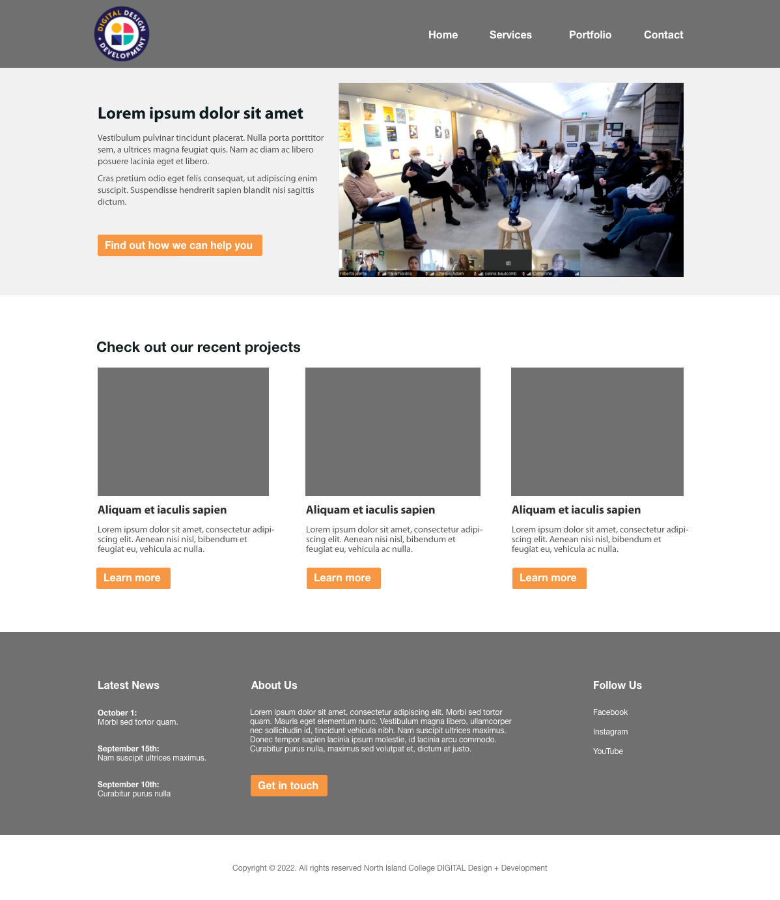

# Extra Assignment - Floats

## Objectives
Create a page layout using floats, no flexbox allowed.

## Step 1: Instructions
1. Clone this repository onto your local computer.
2. In VS Code, create a new HTML file and an external stylesheet.
3. Using floats, create the layout in the wireframe below:

Tips: 
- Figure out your HTML structure for the whole page before you think about CSS
- Make your HTML as semantically correct and streamlined as possible. 
- You can copy and paste lorem ipsum content from here: https://www.lipsum.com/feed/html
- The images are available in the images folder
- You can use any sans-serif font and pick any grays/orange that you like
- Use the VSCode HTMLHint extension and the browser developer tools to help you debug your code
- Remember that there are always many ways to code a layout

### Step 2: Submit your work
Complete the following steps from the GitHub and GitHub Desktop Reference Guide:
1. Commit your changes if you’ve made changes since the last commit.
2. Push your changes to GitHub.
3. Submit your assignment in BrightSpace:
    * Click on the assignment submission link and follow the provided instructions. 
    * Don’t forget to answer the questions and attach the screenshots of your final W3 HTML and CSS validation results.
4. If you have been using a lab computer at the Comox Valley Campus to do your work with GitHub Desktop, remember to shutdown or restart the computer before you leave the room, so that other students won’t have access to your repositories.

## Deadlines
Assignments must be submitted before the end of the week but they will only be graded at the end of every unit. Late assignments will not be accepted and will receive an F. You can complete and submit a contract that allows you to extend the deadline for an assignment but you must email it to your instructor a minimum of 48 hrs before the deadline. Deadline extensions are only allowed for those unplanned, unexpected emergencies that life sometimes throws at us, and they will only be approved by your instructor if you follow the correct process. See the Course Info folder in BrightSpace for more info.